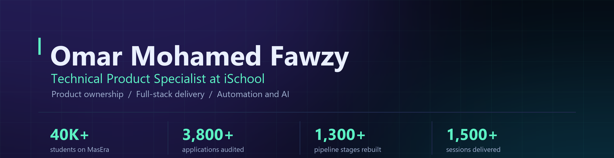

 

  

---

## The short version

I am a **Technical Product Specialist at iSchool** in Cairo. I take products from
discovery and stakeholder input all the way through requirements, UX and workflow
design, data modeling, automation, implementation, QA and production support.

Most of what I build is internal and private, so this repository list is the small
part of the picture. Here is what the work actually adds up to:

| | | | |
|:---:|:---:|:---:|:---:|
| **40K+** | **3,800+** | **1,300+** | **1,500+** |
| students on MasEra | applications audited | pipeline stages rebuilt | sessions delivered |

---

## Running in production

| | Project | What it does |
|:---:|:---|:---|
| 🎓 | **[MasEra](https://masera-seven.vercel.app)** | Arabic-first B2C learning and commerce platform. Student onboarding, course discovery, enrollment and purchase flows, quizzes, progress tracking, and a Bunny video pipeline with TUS uploads and signed playback. |
| 🧩 | **[iSchool B2G Hiring Platform](https://hiring.ischooltech.com)** | End to end tutor hiring: applicants, jobs, approvals, review flows, filters, dashboards. I owned the requirements, the UX, the schema, the SQL migrations and the production debugging. |
| 🕹️ | **[Portfolio](https://shklala.github.io/omar-m-fawzy-portfolio/)** | Hand built, no framework, no build step. Has a guide bot that explains each section, travels by portal, and a cheat code worth finding. |

### Open source

<table>
<tr>
<td width="50%" valign="top">

**[Smart Student Feedback Generator](https://github.com/shklala/ST-Feed-Back-Generator-)**

Helps teachers write personalised, constructive feedback fast, with AI drafting
and a conversational refinement loop.

`JavaScript` `Puter.js AI`  ·  [Live demo](https://shklala.github.io/ST-Feed-Back-Generator-/)

</td>
<td width="50%" valign="top">

**[Session Issue Report Generator](https://github.com/shklala/feedback-creator)**

Turns messy session problems into structured, consistent reports for moderation,
copied in one click.

`HTML` `CSS` `JavaScript`  ·  [Live demo](https://shklala.github.io/feedback-creator/)

</td>
</tr>
<tr>
<td width="50%" valign="top">

**[Chatbot Academy](https://github.com/shklala/chatbot-lessons)**

Teaches Python and AI through chatbot lessons, with a progressive curriculum and
an in browser code editor.

`JavaScript` `Python`  ·  [Live demo](https://shklala.github.io/chatbot-lessons/)

</td>
<td width="50%" valign="top">

**[Multithreading for AI Tasks](https://github.com/shklala/Multithreading-)**

University research on multithreading across image classification, object
detection and data transmission.

`Python` `TensorFlow` `Computer Vision`

</td>
</tr>
</table>

> The rest stays private, and I am glad to walk through any of it: a support platform
> pairing an Arabic AI tier with human escalation, an LMS and video infrastructure
> build, internal operations and payroll systems, and the iSchool website.

---

## What I build with

<table>
<tr><td><b>Product</b></td><td>Discovery, requirements, user stories, workflows, acceptance criteria, QA, feature validation, stakeholder alignment</td></tr>
<tr><td><b>Frontend</b></td><td>React, Next.js, Vite, TypeScript, Tailwind CSS, responsive and RTL interfaces</td></tr>
<tr><td><b>Backend and data</b></td><td>Supabase, PostgreSQL, SQL migrations, database triggers, row level security, REST APIs, authentication</td></tr>
<tr><td><b>Automation and AI</b></td><td>n8n, webhooks, API orchestration, Telegram, Gemini, LangChain, Chroma DB, YOLOv8, TensorFlow</td></tr>
<tr><td><b>Media and LMS</b></td><td>Bunny Video, TUS uploads, signed playback, Moodle, H5P, lesson progress tracking</td></tr>
<tr><td><b>Also</b></td><td>Python, IT systems administration, help desk operations, software licensing and compliance</td></tr>
</table>

---

## Activity

  

---

## Background

**Bachelor's degree, Computer Science** at Culture and Science City, 2019 to 2023.

Cambridge English Assessment C2 Proficient (25/25), EF SET C1 Advanced, and a K-12
educational certificate. Arabic is my first language and I work in English daily.

Alongside product work I administer IT infrastructure and lead help desk operations
for **Holol PMS** in the UAE, and earlier I generated and analysed mathematical
failure cases in AI models with **Outlier** to test model robustness.

---

**Open to product and technical product roles.**

Reach me at **[omar55138@gmail.com](mailto:omar55138@gmail.com)** or on
**[LinkedIn](https://www.linkedin.com/in/omarmfawzy/)**. Based in Giza, Egypt.

 

